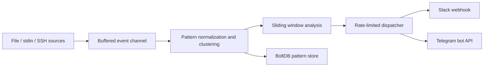

# LynxEye

[](https://go.dev/)
[](https://github.com/spf13/cobra)
[](https://github.com/etcd-io/bbolt)
[](https://github.com/hamdyelbatal122/LynxEye/actions/workflows/ci.yml)
[](https://github.com/hamdyelbatal122/LynxEye/actions/workflows/release.yml)

LynxEye is a production-grade Go CLI for streaming log intelligence. It reads logs from local files, stdin, and remote SSH tails, clusters repetitive events into reusable patterns, detects burst anomalies with a sliding-window baseline, persists learned state between restarts, and emits rate-limited alerts to Slack and Telegram.

## Highlights

- High-throughput concurrent pipeline built with goroutines and channels
- Multi-source ingestion with `file`, `stdin`, and `ssh` providers
- Drain-inspired normalization for reusable pattern clustering
- Sliding-window anomaly detection with EWMA-style adaptive baseline
- BoltDB persistence for pattern continuity across restarts
- Slack and Telegram delivery modules with alert rate limiting
- YAML configuration for sources, thresholds, ignore rules, and outputs
- Cobra-powered CLI with colorized terminal output and startup tables
- Container-ready build, GitHub Actions CI, and automated release packaging included

## Architecture



## Project Layout

```text
.
├── .github/
│   └── workflows/
│       ├── ci.yml
│       └── release.yml
├── .goreleaser.yaml
├── cmd/
│   └── lynxeye/
│       └── main.go
├── config.example.yaml
├── Dockerfile
├── Makefile
├── go.mod
├── internal/
│   ├── alert/
│   ├── app/
│   ├── cli/
│   ├── config/
│   ├── detect/
│   ├── ingest/
│   ├── model/
│   ├── store/
│   ├── ui/
│   └── version/
└── README.md
```

## Installation

### One-liner (Linux & macOS)

```bash
curl -sSL https://raw.githubusercontent.com/hamdyelbatal122/LynxEye/main/install.sh | bash
```

The script will:
- Auto-detect your OS and CPU architecture
- Download the latest release binary from GitHub
- Verify the SHA-256 checksum
- Install `lynxeye` to `/usr/local/bin`

### Manual download

Pre-built binaries for Linux, macOS, and Windows are available on the [Releases page](https://github.com/hamdyelbatal122/LynxEye/releases).

### Build from source

```bash
git clone https://github.com/hamdyelbatal122/LynxEye.git
cd LynxEye
go build ./cmd/lynxeye
```

---

## Quick Start

### Build from source

```bash
go build ./cmd/lynxeye
```

### Create config

```bash
cp config.example.yaml config.yaml
```

### Run against a local file source

```bash
./lynxeye run --config config.yaml
```

### Stream from stdin

```bash
journalctl -f -u nginx | ./lynxeye run --config config.yaml
```

## Configuration

```yaml
app:
   name: LynxEye
   buffer_size: 4096

state:
   path: ./state/patterns.db

detection:
   window: 5m
   min_events: 8
   spike_multiplier: 3.0
   ewma_alpha: 0.35
   alert_on_new_pattern: true

alerts:
   rate_limit: 15m
   slack:
      enabled: false
      webhook_url: https://hooks.slack.com/services/XXX/YYY/ZZZ
   telegram:
      enabled: false
      bot_token: 123456:ABCDEF
      chat_id: "-1001234567890"

sources:
   - name: api-local
      type: file
      path: /var/log/api.log
      read_from_start: false
      poll_interval: 1s
      ignore_patterns:
         - healthcheck
         - readiness probe
```

### Source providers

- `file`: tails or replays local files
- `stdin`: consumes piped streams
- `ssh`: tails remote files over SSH using password or key auth

## CLI

```bash
lynxeye run --config config.yaml
lynxeye run --config config.yaml --once
lynxeye sample-config
lynxeye version
```

`--once` is useful for finite replay jobs, CI checks, and smoke tests.

## Development

```bash
make fmt
make test
make build
make docker-build
```

### Release a version

```bash
git tag v0.1.0
git push origin v0.1.0
```

Pushing a `v*` tag triggers GitHub Actions to build Linux, macOS, and Windows artifacts and publish them as a GitHub Release.

Direct commands:

```bash
go test ./...
go build ./cmd/lynxeye
```

## Production Notes

- Pattern state is persisted with BoltDB.
- Alerts are rate-limited per notifier and pattern key.
- SSH host verification falls back to insecure mode only if `known_hosts_path` is omitted.
- The runtime now drains buffered events before shutdown in batch mode.

## Roadmap

- Prometheus metrics and OpenTelemetry tracing
- Full Drain tree or SLCT-based clustering backends
- Optional REST or gRPC control plane
- Additional sinks such as email, PagerDuty, or Kafka

## License

This project ships with the MIT License. See `LICENSE` for the full text.
